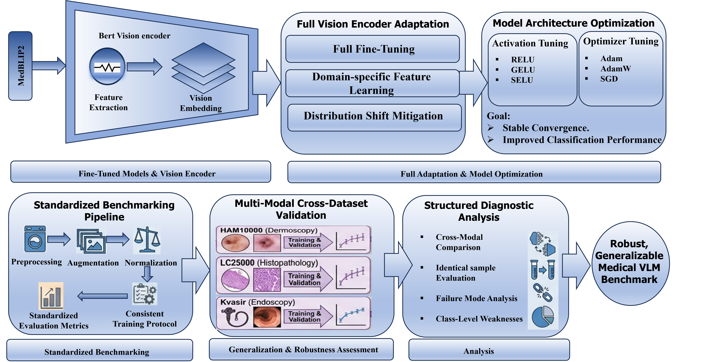
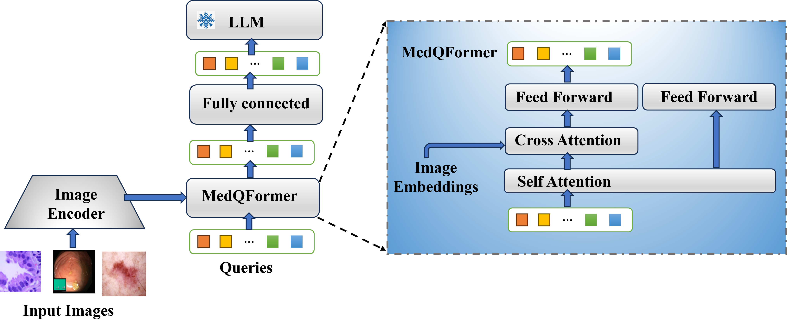
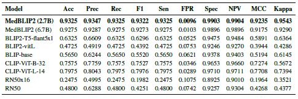
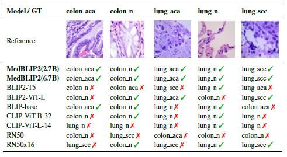
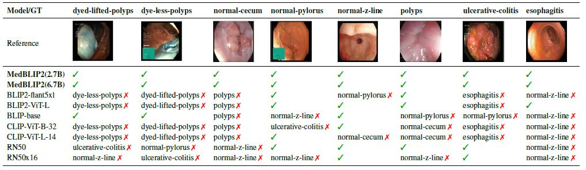
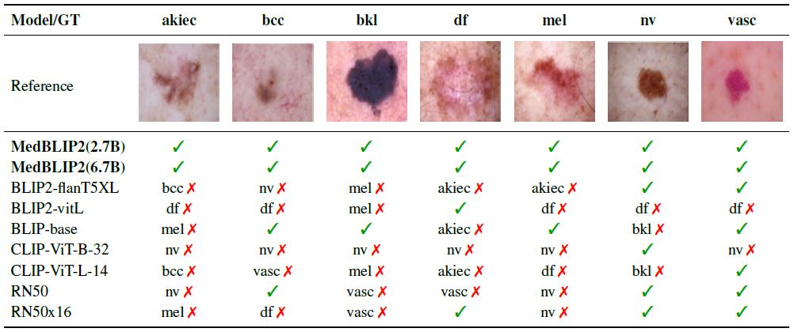

# Medical Vision–Language Models for Robust Disease Diagnosis
This paper has been submitted for publication in PHAROS AI Factory for Medical Imaging & Healthcare (PHAROS-AIF-MIH) in conjunction with the IEEE Computer Vision and Pattern Recognition Conference (CVPR), 2026

## Overview
**MedBLIP2** is a lightweight medical vision-language framework built on BLIP-2 for robust disease diagnosis across multiple medical imaging domains.

This repository provides:
- **MedQFormer-based adaptation**
- **Benchmarking on LC25000, Kvasir, and HAM10000**
- **Training, evaluation, and visualization scripts**
- **Comparisons with BLIP, CLIP, and ResNet baselines**
  
## Highlights
- **Medical-domain adaptation** of BLIP-2 for disease classification
- **Unified benchmark** across histopathology, GI endoscopy, and dermoscopy
- **Strong performance** with MedBLIP2-OPT-2.7B and MedBLIP2-OPT-6.7B
- **Reproducible experimental pipeline**

## Abstract

Medicine inherently involves integrating diverse data modalities, making multimodal learning a crucial component of computer-aided diagnosis. Recent advances in generative vision-language models have opened new possibilities for medical applications but remain limited by domain adaptation and computational complexity. In this study, we propose MedBLIP2 (2.7B), a lightweight vision-language pretraining framework tailored for the medical domain. The model leverages frozen off-the-shelf image encoders and large language models, linked through a novel MedQFormer module that effectively aligns visual and textual representations. Based on the BLIP-2 architecture, MedBLIP2 (2.7B) employs a two-stage pretraining strategy: (1) vision-language representation learning from a frozen image encoder and (2) vision-to-language generative learning from a frozen language model. Experimental results demonstrate that MedBLIP2 (2.7B) achieves state-of-the-art performance across multiple medical classification applications, surpassing BLIP-base and CLIP by 40.7\% and 23.1\%, respectively, on the lung tissue identification task. Further evaluations across diverse datasets confirm the model’s robust generalization and strong potential to enhance AI-assisted clinical diagnostics.

## Tools and Libraries
- PYTHON
- PYTORCH
- NUMPY
- PANDAS

# Figures
## MedBLIP2 architecture

  

Figure 1. The overall architecture and workflow of our proposed vision-language model for medical image analysis.

## MedQFormer architecture

  

Figure 2. MedQFormer queries the frozen image encoder’s output
embeddings to extract compact visual representations, which
are converted into soft prompt tokens and injected into the frozen
LLM to enable instruction-guided medical inference.
## Comparison with State-of-the-Art

  

| Model | Acc | Prec | Rec | F1 | Sen | FPR | Spec | NPV | MCC | Kappa |
|---|---:|---:|---:|---:|---:|---:|---:|---:|---:|---:|
| **MedBLIP2 (2.7B)** | **0.9325** | **0.9347** | **0.9325** | **0.9322** | **0.9325** | **0.0096** | **0.9903** | **0.9904** | **0.9235** | **0.9543** |
| MedBLIP2 (6.7B) | 0.9275 | 0.9287 | 0.9275 | 0.9273 | 0.9275 | 0.0103 | 0.9896 | 0.9896 | 0.9175 | 0.9290 |
| BLIP2-T5-flant5xl | 0.6325 | 0.6609 | 0.6325 | 0.6296 | 0.6325 | 0.0525 | 0.9475 | 0.9484 | 0.5891 | 0.6364 |
| BLIP2-vitL | 0.4725 | 0.4919 | 0.4725 | 0.4392 | 0.4725 | 0.0753 | 0.9246 | 0.9270 | 0.3944 | 0.4286 |
| BLIP-base | 0.5650 | 0.6244 | 0.5650 | 0.5520 | 0.5650 | 0.0621 | 0.9378 | 0.9403 | 0.5194 | 0.6145 |
| CLIP-ViT-B-32 | 0.7575 | 0.7759 | 0.7575 | 0.7527 | 0.7575 | 0.0346 | 0.9653 | 0.9660 | 0.7274 | 0.5672 |
| CLIP-ViT-L-14 | 0.7975 | 0.8043 | 0.7975 | 0.7976 | 0.7975 | 0.0289 | 0.9710 | 0.9711 | 0.7708 | 0.7394 |
| RN50x16 | 0.2475 | 0.4995 | 0.2475 | 0.1982 | 0.2475 | 0.1075 | 0.8925 | 0.9010 | 0.1964 | 0.3521 |
| RN50 | 0.4800 | 0.6288 | 0.4800 | 0.4251 | 0.4800 | 0.0742 | 0.9257 | 0.9304 | 0.4268 | 0.4377 |
Table 1. Performance comparison across multiple evaluation metrics
for gastrointestinal tract analysis.
## MedBLIP2 evaluation on the LC25000 dataset

  

Table 2. Predicted labels on LC25000 dataset. Each column represents
the same representative histopathology image patch, while each row reports the prediction produced by different models.
## MedBLIP2 evaluation on the Kvasir  dataset

  

Table 3. Predicted labels for MedBLIP2 (2.7B, 6.7B) and baseline models compared to the ground-truth class (dyed-lifted-polyps, dyeless-
polyps, normal-cecum, normal-pylorus, normal-z-line, polyps, ulcerative-colitis, and esophagitis).
## MedBLIP2 evaluation on the HAM10000  dataset

  

Table 4. Qualitative summary of predicted labels for representative HAM10000 samples. The reference row lists the ground-truth classes.
Correct predictions are marked with a green check, while misclassified samples are represented by the incorrectly predicted class followed
by a red cross.
